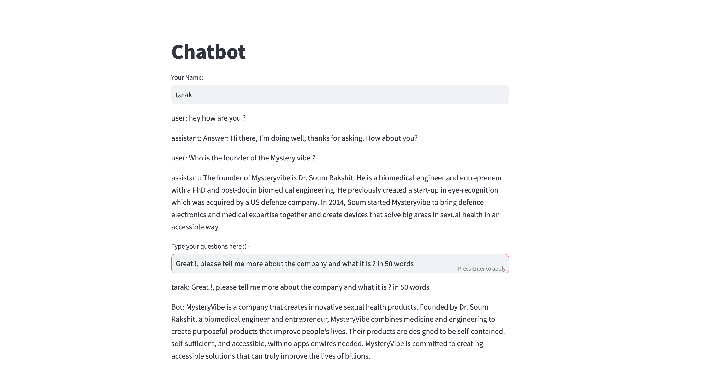

# A End to End Guide on Custom Chatbot with OpenAI (ChatGPT)

Welcome to the Custom Chatbot with OpenAI project! This project aims to guide you through the process of building a custom chatbot using OpenAI's language model. The chatbot is designed to interact with users and provide relevant responses based on a knowledge base.

## Getting Started

To get started with the project, follow the steps below:

1. Clone the project repository to your local machine.
2. Install the required dependencies by running the following command: `pip install -r requirements.txt`.

## Setting Up OpenAI API

To use the chatbot, you need to obtain an API key from OpenAI. Follow the instructions below to set up the API:

1. Sign up for an account on the OpenAI website.
2. Once you have an account, obtain your API key.
3. Set the API key in the appropriate code file (`chatbot.py` or `app.py`) by replacing `'Add your API Key here'` with your actual API key.

## Building the Chatbot

The chatbot is built in two main steps: creating a knowledge base and implementing the chatbot class. Follow the instructions below:

### Creating a Knowledge Base

1. Prepare a collection of documents or data that will serve as the knowledge base for the chatbot. The documents should be in a format that can be indexed and searched.
2. Use the `GPTVectorStoreIndex` class from the Llamas library to create an index for the documents. This will enable efficient retrieval of information.
3. Save the index to a persistent storage directory.

### Implementing the Chatbot Class

1. Use the `Chatbot` class provided in the code to implement the chatbot functionality.
2. Set the API key, index, and other necessary parameters in the `Chatbot` class constructor.
3. Use the `generate_response` method to generate responses based on user input.
4. Customize the chatbot's behavior and responses by fine-tuning the prompts and training data.

## Running the Chatbot

To run the chatbot, execute the following steps:

1. Ensure that you have set up the API key and other configurations in the appropriate code file.
2. Run the `streamlit run app.py` in your terminal, Access the application through the provided URL.

## Conclusion

Congratulations! You have successfully set up and implemented a custom chatbot with OpenAI. Feel free to customize and enhance the chatbot's functionality based on your specific requirements. Enjoy exploring the possibilities of conversational AI with OpenAI's powerful language model.

